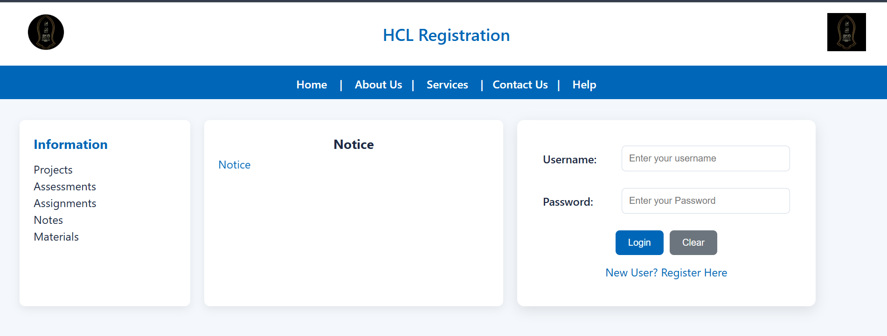

# js_internal_005
HCL Training Repository 
# JavaScript & C# Assessment Projects

This repository contains two separate assessments developed as part of training and evaluation requirements. The projects are organized into dedicated folders for clarity and ease of navigation.

---

## 📁 JavaScript Assessment

**Location:** `Final_Project/`

The JavaScript assessment implements a simple **web-based user registration and login system** using HTML, CSS, and JavaScript.

### 🔹 Key Features
- Home page acts as the entry point of the application
- Login functionality with basic validation
- Registration page accessible from the home page

### 🔹 How to Access Registration Page
1. Open the **Home page** (`index.html`) inside the `Final_Project` folder
2. Click on the link:
   **“New User? Register Here”**
   
4. This redirects to the **Registration Page**, where the user can enter details and submit the form

The project demonstrates:
- Client-side validation
- Event handling
- Dynamic data handling
- Clean UI and structured code

---

## 📁 C# Assessment

**Location:** `C#_Project/`

The C# assessment is a **console-based Hospital Patient Management System** designed using object-oriented and event-driven programming concepts.

### 🔹 Files Included

#### 1️⃣ `patient_management.cs`
- Main and required file
- Takes **all patient inputs at runtime**
- Implements:
  - Classes and objects
  - Interfaces
  - Delegates
  - Events
- Allows user to:
  - Enter patient details
  - Select patient type
  - Generate treatment bill dynamically

#### 2️⃣ `hospital.cs`
- Handles **billing logic**
- Generates bill based on **predefined charges**
- Billing varies according to patient type (General / ICU / Emergency)

### 🔹 Concepts Demonstrated
- Object-Oriented Programming (OOP)
- Inheritance and Polymorphism
- Delegates for dynamic billing
- Events for hospital notifications
- Console-based user interaction

---

## ✅ Conclusion
This repository showcases both **(JavaScript)** and **(C#)** and the **Assignments** of both JS and C#

---

